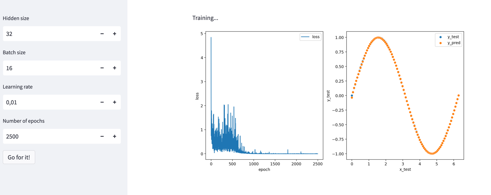

# Build a NN Playground via ChatGPT

### Hey ChatGPT, let's build a NN demo for our BarCamp!

Fit a simple neural network to a sine wave. 

So let's build this ...


... to catch this:


### Result

#### Looks like this



#### Medium Post

[Click me](https://medium.com/@carsten.frommhold/build-a-nn-playground-via-chatgpt-dca82d7a4b5)

#### Start App via 

```python
streamlit run src/app.py
```