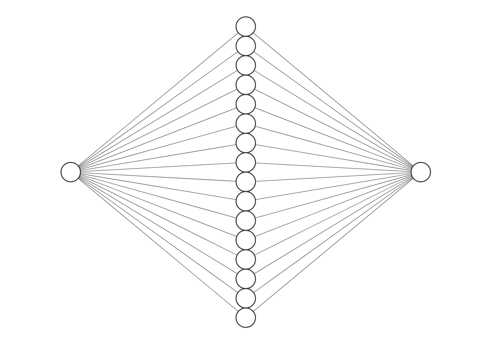

# Build a NN Playground via ChatGPT

### Hey ChatGPT, let's build a NN demo for our BarCamp!

Fit a simple neural network to a sine wave. 

So let's build this ...



... to catch this:


### Result

### Looks like this


### Medium Post

[Click me](...)

#### Start App via 

```python
streamlit run app.py
```